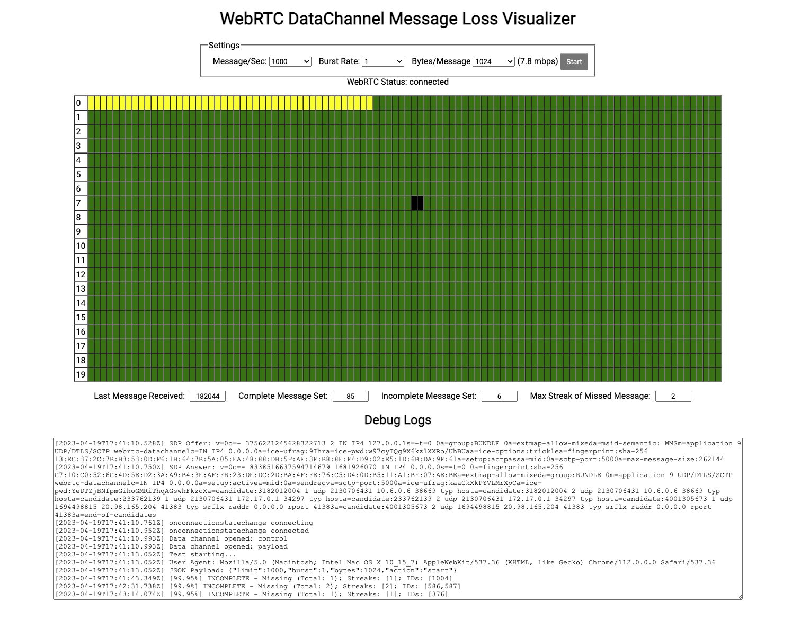

[](https://github.com/masterjk/webrtc-network-traffic-visualizer/actions/workflows/docker-image.yml)

# webrtc-network-traffic-visualizer

Web application to visualize WebRTC data channel packet loss conditions over different network conditions.

## Usage

```
$ docker run --name visualizer -d -p 8080:8080 docker.io/josephkiok/webrtc-network-traffic-visualizer:latest
```

## Screenshot


